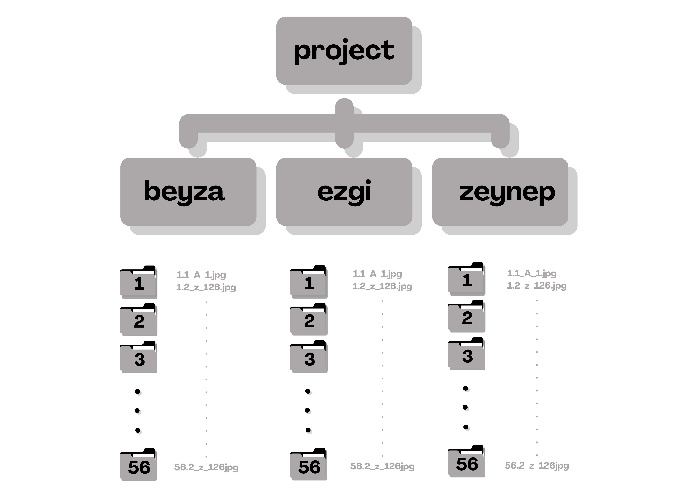
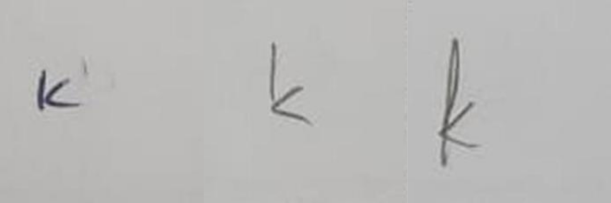

# Handwritten Letter and Person Recognition

This project was developed as part of the **YZV303E Deep Learning Course**. It is designed to recognize **handwritten letters** of the **Turkish alphabet** and uniquely **identify individuals** based on their handwriting styles. The system leverages deep learning techniques to not only detect characters but also use those characters as biometric indicators for person recognition.

## 📌 Project Overview

- Recognize handwritten uppercase and lowercase Turkish letters.
- Identify individuals based on their unique handwriting patterns.
- Utilize a custom-collected dataset from 56 participants.
- Apply deep learning methods for classification and recognition tasks.

## 📁 Dataset

The dataset consists of handwritten letters collected from **56 individuals** using **3 different phone cameras**. Each participant wrote all **126 letters** (uppercase and lowercase) of the Turkish alphabet.

- Each participant folder (e.g., `beyza`, `ezgi`, `zeynep`) contains subfolders numbered `1` to `56`.
- Each subfolder includes the images of handwritten letters from one person.
- Participants also provided signature consent in accordance with **KVKK (Turkish Data Protection Law)**.



Below are examples of how the same letter can appear differently when written by different individuals. These variations highlight the diversity in handwriting styles and the importance of a robust recognition model capable of handling such differences.


<div align="center">
  
</div>

## 🔧 Usage
1. 📥 [Download the Dataset](https://drive.google.com/drive/folders/1x8znRCDLU_i7m5WmKqC_xjEyDXnNW3yR?usp=sharing)
   ```
   https://drive.google.com/drive/folders/1x8znRCDLU_i7m5WmKqC_xjEyDXnNW3yR?usp=sharing
   ```
3. Clone the repository:
   ```bash
   git clone https://github.com/ezgi-aslan/Handwritten-Letter-and-Person-Recognition-Project.git
   ```
   
4. Install dependencies:
   You can install the required Python packages using the following command
   ```
   pip install tensorflow scikit-learn keras Pillow numpy matplotlib seaborn visualkeras opencv-python joblib
   ```

6. Run Jupyter Notebooks:
  - For a deeper analysis and exploration of the Handwritten Letter Recognition model, delve into the Jupyter notebooks located in the notebooks/ directory.
  - You can execute individual cells, allowing you to thoroughly analyze the handwritten letter recognition system. These notebooks provide an interactive environment for visualizing results, examining model architecture, and gaining valuable insights into the recognition process.
